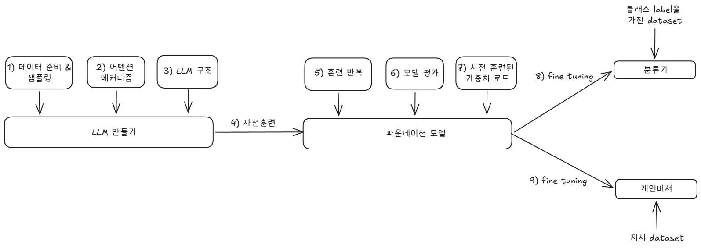

## Chapter 3. 어텐션 메커니즘 구현하기
- 셀프 어텐션에서는 입력시퀀스에 있는 각 원소 xi에 대한 문맥 벡터 zi를 계산하는 것이 목표입니다.
- 문맥 벡터는 정보가 풍부한 임베딩 벡터로 생각할 수 있습니다.

- 문맥 벡터의 목적은 입력 시퀀스에 있는 다른 모든 원소의 정보를 통합해 이 시퀀스에 있는 각 원소의 표현을 풍부하게 만드는 것입니다.
- 이것이 llm의 핵심이며, 문장에서 다른 단어 사이의 관계와 관련성을 이해하기 위해 LLM에 반드시 필요합니다.
- 나중에 LLM이 이런 문맥 벡터를 학습할 수 있도록 훈련 가능한 가중치를 추가하겠습니다.
- 